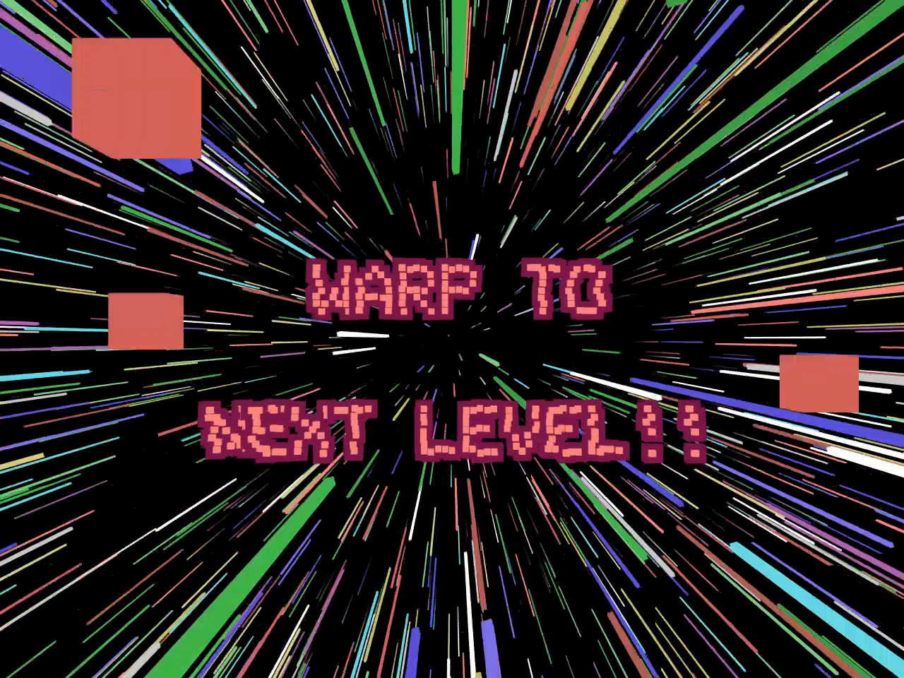

# TIMES-TABLES

## Download:
downdoad the pre-built binary releases here(Windows & Linux):  
https://github.com/kguyaux/timestables/releases/latest

## About:
the TIMES-TABLES is a little game to practise the times-tables.
It is written in C++ and uses openGL & openAL.
The game is inpired by the MSX-1, an 8bit homecomputer of the 80's. The idea of the game originated when I made an opengl-demo
to print the characterset of the MSX, (with 3D-cubes as pixels).  
The 15 colors used are also of the msx1-colorpalette(except text-outlinecolors).

## usage:
* press L to cycle through languages
* press ESC to go back. Also from gameplay. (WARNING you will NOT be asked if sure or not!)
* press ESC in main-title-screen to quit the game.
* press F to toggle fullscreen.
* press ENTER to confirm answer
* press SPACE to START/SELECT/PROCEED

## Gameplay:

  

choose gamemode:  
At the title-menu-screen, first choose the game mode with RIGHT/LEFT/UP/DOWN-keys.
Game modes are:  
* Successive: choose a table to start from. After 10 (correct or incorrect) answers you warp to the next table. For example:
if you choose to start from table 5, you will proceed to the table of 6.
* Single: practice a single table, choose with UP/DOWN. after 5 correct answers, you 'warp', and the difficulty increases
* random: You will be asked randomly, all the tables from 1 to 10.. after 5 correct answers, you 'warp', and the difficulty increases.

.. after confirming with SPACE, you can set the difficulty, with UP&DOWN-keys, choose the speed at which the cyphers are falling.
press space to start playing.
First the question will fly into place, after that the cyphers start falling, at a speed depending on the difficulty-value
(displayed as 'speed': in the top). You have to type quickly, and confirm the answer with ENTER, otherwise the cyphers will
fall into the all-destructing laser-beam.. and you will loose a life.
When an answer is icorrect, points will be given. The amount of points gained with each correct answer, is based on difficulty.
The game has no end. The goal is to gather as much pints as possible.
Good Luck & Have fun!

## Known bugs/issues:
* when ESC is pressed during warp to next level, the game goes back to title but the stars remain in 'hyperdrivemode'. I like it so I decided to keep it, but this 'feature' might dissapear in the future.
* The text does not auto-scale, especially the title might be cropped in certain languages or window-dimensions.
* Random function does not work too well yet. You can be asked the same question too soon.
* The translations may not be very goed.

## BUILD:

linux:  
first you need these dependencies:
- libxcursor
- libxineram
- pulseaudio

on ubuntu:  
`sudo apt update; sudo apt install libxinerama libxcursor libpulseaudio`  
.. and maybe some other things I have to check...  
on fedora/centos:  
`coming soon...`  

`git clone https://github.com/kguyaux/timestables.git --recurse-submodules  
cd timestables  
mkdir build  
cd build  
cmake ../    
make` (or `make -j4` to build faster)  

for debugging(when changing the code yourself), instead of `cmake ../`, use:  
`cmake -DCMAKE_BUILD_TYPE=Debug ../`. This way you can make use the IMGui-api for testing stuff.  

Run the game by typing:  
`./tables`  

In case of audioproblems(error-messages and/or not hearing any..), start the game with:  
`padsp ./tables`  

windows:  
`git clone https://github.com/kguyaux/timestables.git --recurse-submodules`  
Use cmake to generate a solution, and load it with VisualStudio.  
I will add the solution later..

## credits
Made by KG-Soft 2020
sounds are sampled from old 8bit games
DISCLAIMER: if something or someone gets damaged, then I am not responsible.

